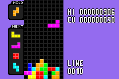

# Hexis
   
Hexis is a game about fitting falling blocks together to clear completed lines.   
It's made completely in assembly for the GNU Assembler included in devkitARM.

To compile a ROM file you can use the included Makefile: ([devkitARM](https://devkitpro.org/wiki/devkitPro_pacman) is needed)

    make

You can then run the generated gba file on an emulator or even on real hardware!
